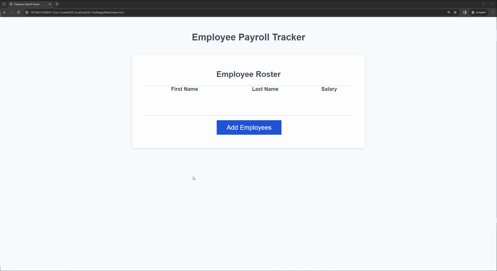

# Employee-Payroll-Tracker
## Overview

This project forms an Employee Payroll Tracker, with HTML, CSS, and JavaScript. This website provides an interface to track employee's information through their:

- First Name
- Last Name
- Salary

Users can add employees to the table and display the information alphabetically by last name. Additionally, the application calculates the average salary of all employees. It also selects a random employee from the list.

# Features

1. **Add Employees:**
    
    - Clicking the 'Add Employees' button prompts the user to input the employee info (First Name, Last Name, Salary) through JavaScript prompts.

2. **Calculate Average Salary:**

    - After adding employees, the website calculates and displays the average salary of all employees in the console.

3. **Select Random Employee**

    - The website randomly selects a lucky employee from the list and announces the winner in the console.

(./images/03-javascript-homework-console-demo.png)

# Links

- [GitHub Website](https://joelamaya19.github.io/Employee-Payroll-Tracker/)

# License
 
 N/A